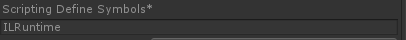

# Unity中Tolua、SLua、XLua与ILRuntime效率对比

参考了代码 https://github.com/cateatcatx/UnityScriptPTest，并将xLua和ILRuntime升级到新版本（新版本性能有明显优化）。

其说明[http://blog.csdn.net/u011467512/article/details/72716376](http://blog.csdn.net/u011467512/article/details/72716376)

## 注意事项：

### ILRuntime

在Unity中定义Symbol ILRuntime，才真正运行的ILRuntime

### XLua

